# vdirsyncer

### Sync Remote

1. Install synchronize with Remote/Cloud calendar

    ```bash
    pip3 install --upgrade-strategy eager vdirsyncer
    ```

#### Google Calendar

##### Google API Manger

1. Create new project in Google API Manager

    1. [Google Api Manager](https://console.developers.google.com/)
        * Project Name: {NAME}-{NUMBER}
        * Location: _Optional_
        * Click <kbd> Create </kbd>

            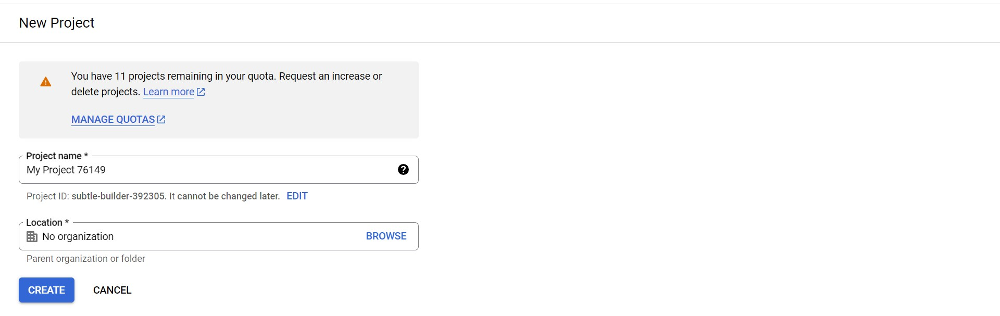

    2. API and Service Home Page

        

    3. Click <kbd> + ENABLE APIS AND SERVICE </kbd>

        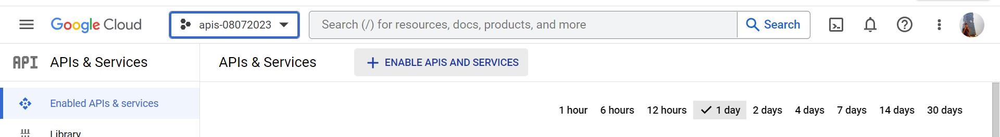

2. Enable **CalDav API** for google calendar API access

    1. API Library homepage

        

    2. Search **CalDav API**

        

    3. Click to enable **CalDav API**

        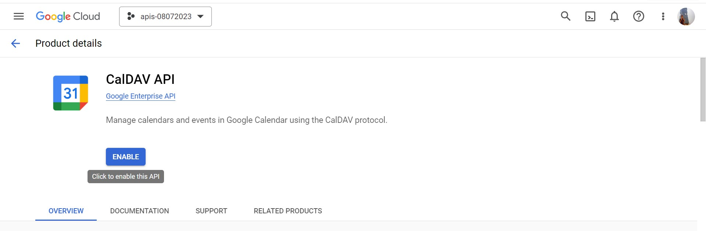

    4. Success enable **CalDav API**

        

3. Enable Authorize Credentials

    1. Click left side-bar **Credentials**

        

    2. Click <kbd> + CREATE CREDENTIALS </kbd> and <kbd> + OAuth client ID </kbd>

        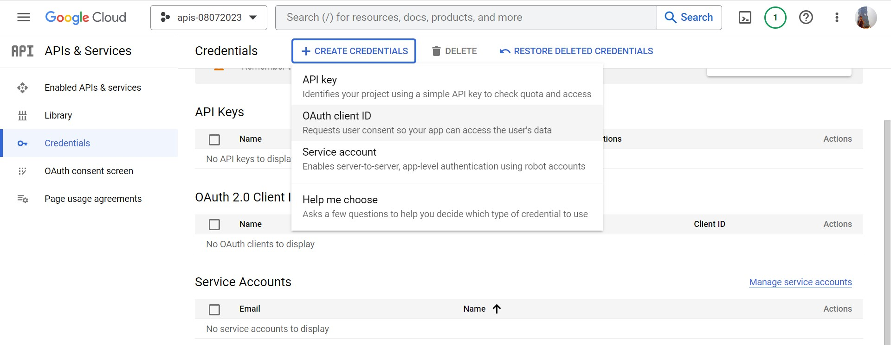

    3. Click <kbd> CONFIGURE CONSENT SCREEN </kbd>

        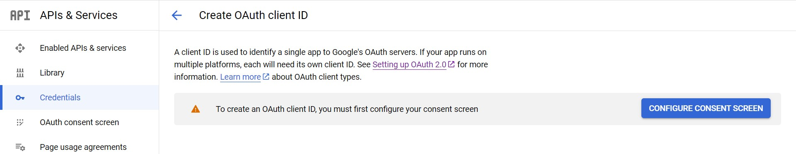

    4. Create OAuth consent screen with **External** and click <kbd> CREATE </kbd>

        

        1. Edit app registration
            * App Name: _required_
            * User Email: _required_
            * Develops Email: _required_

            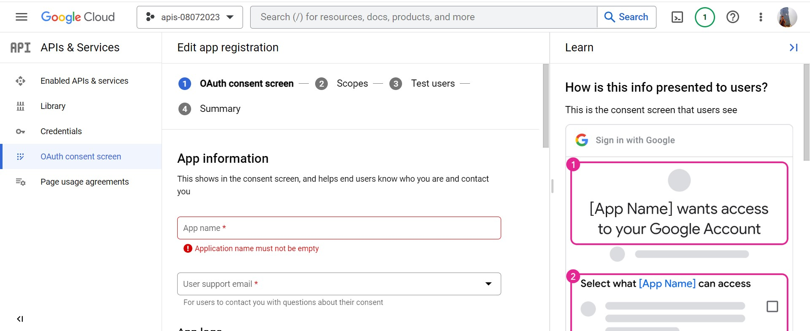

        2. Scopes
            * click <kbd> Save and Confirm </kbd>

            

        3. Test Users

            * click <kbd> Save and Confirm </kbd>

            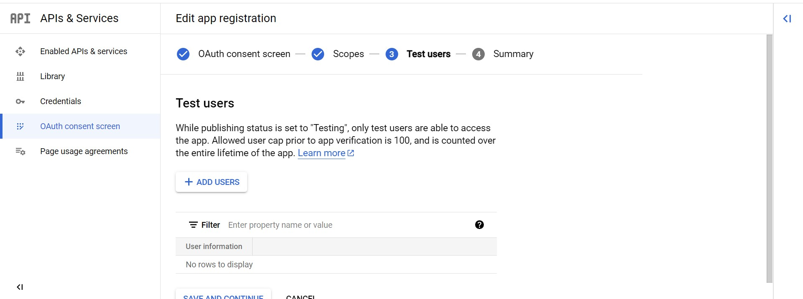

        4. Summary

            

4. Enable Web Application

    1. Click left side-bar **Credentials**

        

    2. Click <kbd> + CREATE CREDENTIALS </kbd> and <kbd> + OAuth client ID </kbd> then select **Web Application**

        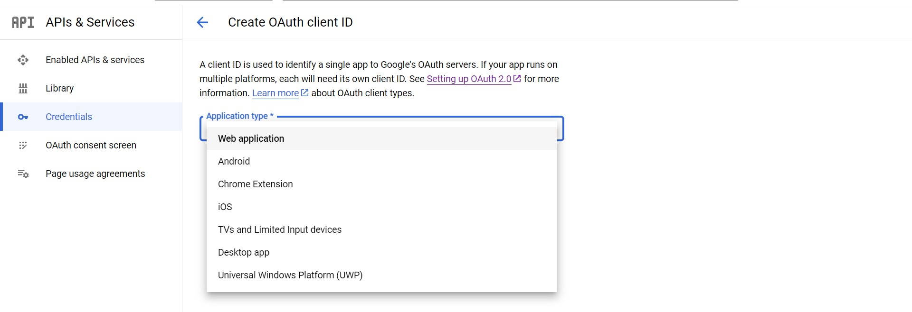

    3. Create **Web Application**

        * **redirect URLs**: `http://127.0.0.1` [^u1]

        

    4. Created OAuth Client for **Web application**

        * `Client ID` + `Client secret`

        

##### Unix-Like System

1. Create vdirsyncer configuration file

    ```bash
    mkdir -p ~/.config/vdirsyncer
    touch ~/.config/vdirsyncer/config
    ```
2. Copy the contents below into configuration file

    * `client_id` and `client_secret` is created from _OAuth Client for Web Application_

        

    ```bash
    cat <<-EOF > ~/.config/vdirsyncer/config
    [general]
    status_path = "~/.calendars/status"

    [pair personal_sync]
    a = "personal"
    b = "personallocal"
    collections = ["from a", "from b"]
    metadata = ["color"]

    [storage personal]
    type = "google_calendar"
    token_file = "~/.vdirsyncer/google_calendar_token"
    client_id = "241086233307-rdb38l3lfa7bjlfetgsg0lg2bp47hgmc.apps.googleusercontent.com"
    client_secret = "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"

    [storage personallocal]
    type = "filesystem"
    path = "~/.calendars/"
    fileext = ".ics"
    EOF
    ```

3. Discover google calendar via CalDav APIs

    * `personal_sync` is discover pair, please refer in configuration file above.

    ```bash
    vdirsyncer discover personal_sync
    ```

4. Select google account

    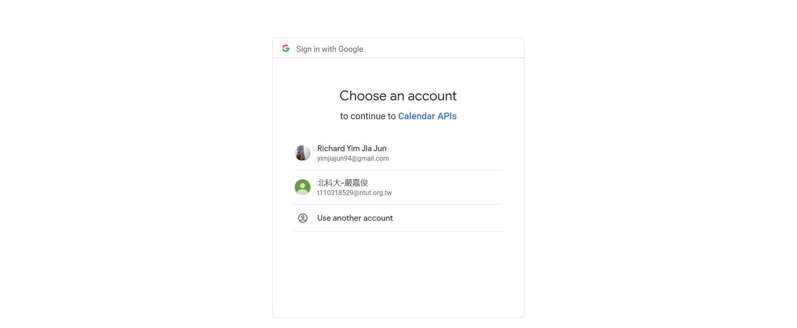

    * click _Advanced_ and click <kbd> Go to \<api name\> (unsafe) </kbd>

        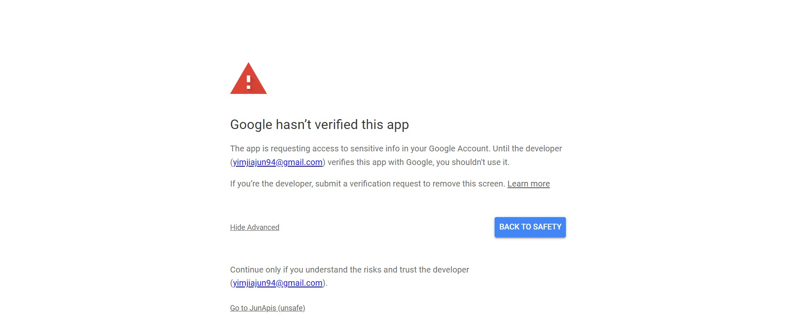

    * Continue access calendar with APIs

        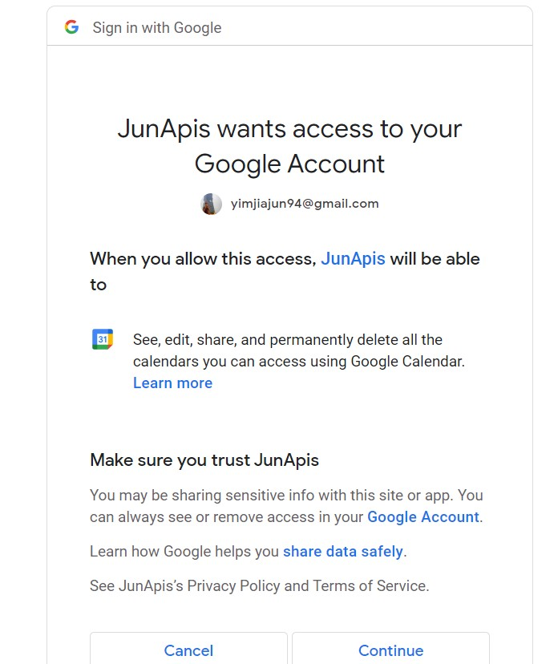

    * Success obtained token

        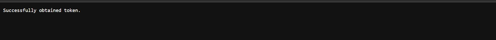

5. Sync Google Calendar

    ```bash
    vdirsyncer sync
    ```

6. add category for each imported contents

    * append into `~/.config/khal/config` depending on contents of `~/.calendars/`

        ```bash
        [[ ${NAME} ]]
        path = "~/.calendars/${content_file}"
        color = blue
        ```

[^u1]: http://127.0.0.1: redirect url will discover by **vdirsyncer** with random port number
