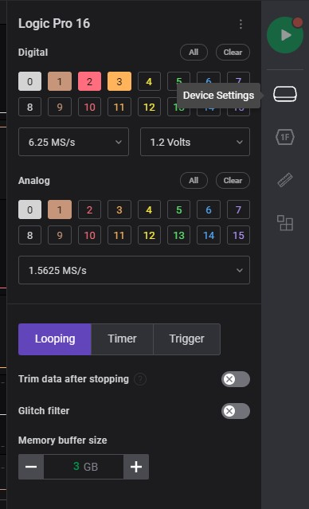
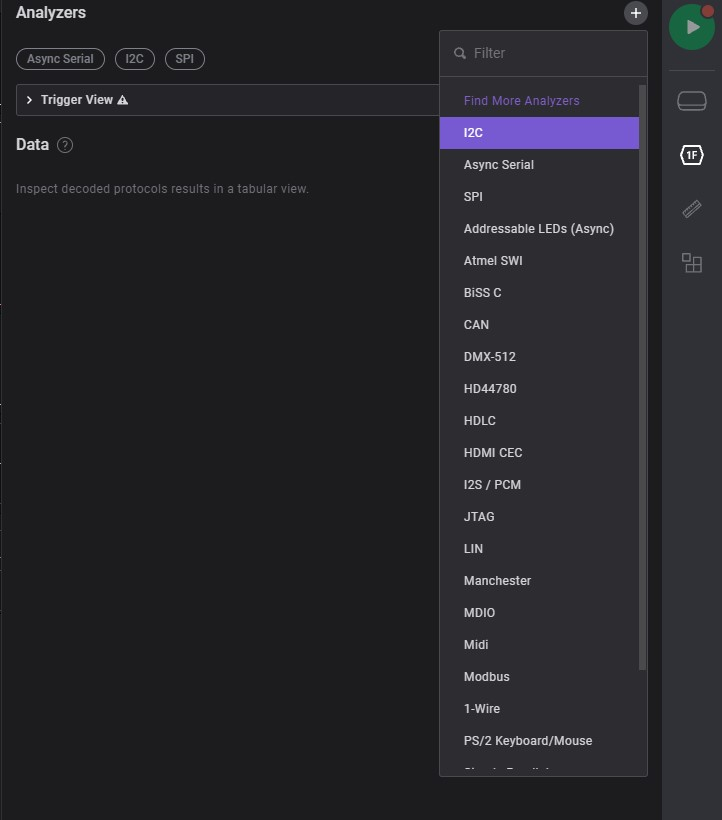
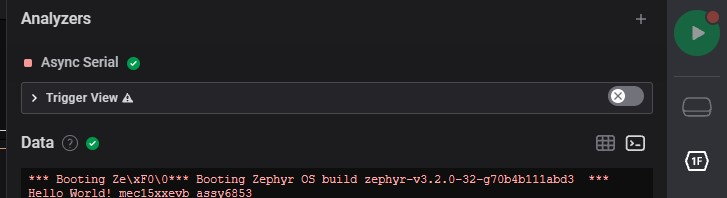

# SALEAE

Effortlessly decode protocols like SPI, I2C, Serial, and many more.
Leverage community created analyzers or build your own low-level or high-level protocol analyzer.

software download: [Logic](https://www.saleae.com/downloads)

- [Note](saleae_note.md)

## Introduction

### Execute Program

Executable program for saleae software in window:

### Home page

Home page without connecting saleae device

### Device Settings

Connector settings to enable / disable displays connector and measurement frequency.

### Analyzers

This sections is customize or selection on connecting interface. Which is able to analyze connecting interface as data.

1. The first icon on right side-bar

    

2. Add Filter: select connecting interface

    

3. Data Table: displays analyzed data datails (ex. i2c)

    

4. Terminal: displays analuzd data / ascii / etc. on display as terminal (ex. serial)

    

### Measurements

Measurement specfic range of signal details

### Extensions

Extra setup from other users. which able to implements on own project to improve measurement.

