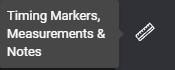
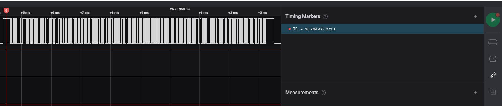
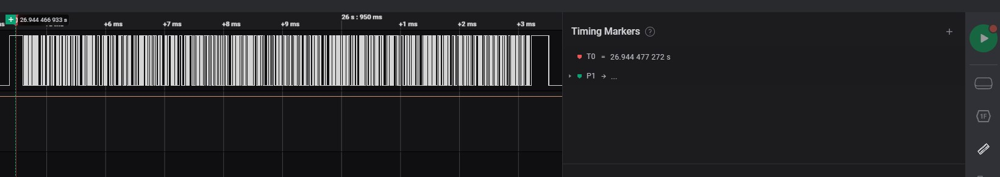
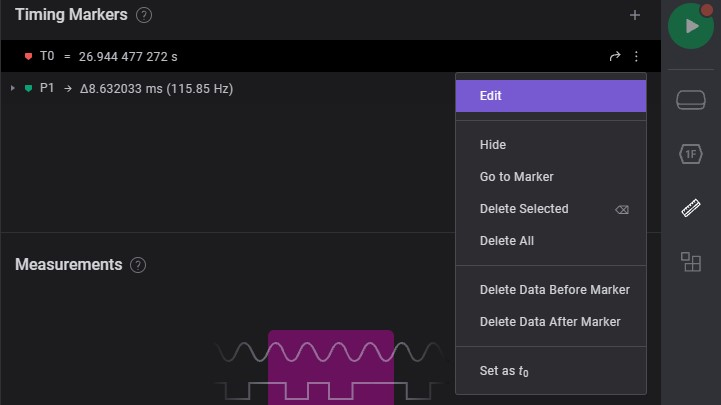

# SALEAE - NOTE

How-to-Note on Saleae program

## TOPIC:

1. [Timing Markers and Measurement and Notes](#timing-markers-and-measurement-notes)
    1. [Timing Markers](#timing-markers)
        - [Add Single Markers](#add-single-marker)
        - [Add Markers Pairs](#add-marker-pair)
        - [Note](#timing-markers-note)
    1. [Measurement](#measurement)
    1. [Notes](#notes)

## Timing Markers and Measurement, Notes

Specific range of signal to measurement

### Timing Markers

Specific timing on measurement

#### Add Single Marker

1. Move to specific timing of signal to measurement

    

2. Click the primary button of mouse to select measurement timing

    

##### Add marker pair

1. Move to begin on specific timing of signal to measurement

    

2. Move to end on specific timing of signal to measurement

    

3. After selected a pair of specific timing

    

#### timing markers note

Add some details or bookmarks on specific timing

1. Click the _3 dots_

    

2. Add comment/details of signal

    

### Measurement

1. Select begin of signal to measurement

    

2. Select end of signal to measurement

    

3. After selected of signal to measurement

    

### Notes

Sharing details of signal information

